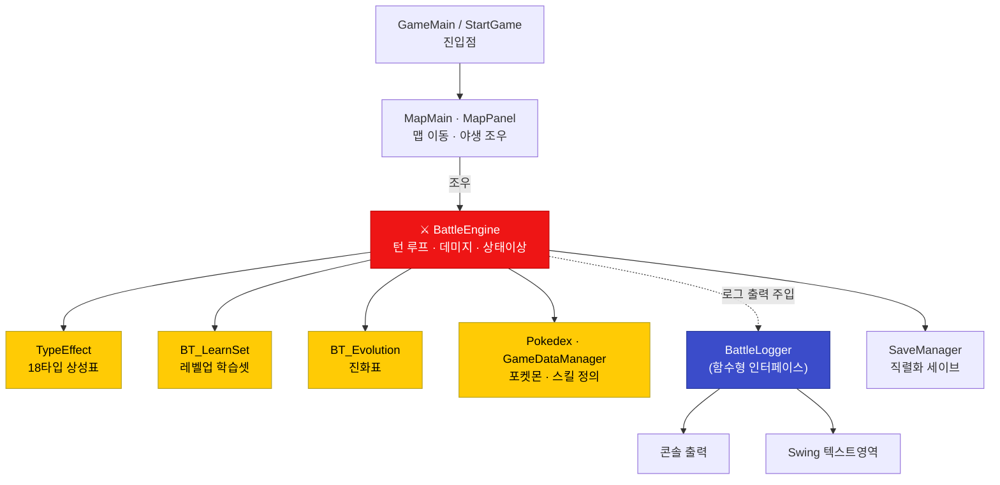

<div align="center">

# ⚡ pokemonJava

### 외부 API·DB 없이, 게임 데이터를 **전부 직접 설계한** 턴제 포켓몬 RPG

18타입 상성 · 상태이상 6종 · 진화 · 레벨업 기술습득까지<br/>
규칙이 서로 얽힌 데이터를 손으로 설계하고 Java Swing으로 구현했습니다.

<br/>


<br/>

**팀 프로젝트 4명** · 2026.03 ~ 2026.04 · 에이콘아카데미<br/>
**조아진 담당 — 전체 설계 주도 · 배틀 엔진 · 타입 상성 · 게임 데이터**

</div>

---

<!-- TODO(비주얼): 아래 위치에 실제 실행 화면을 넣을 예정. 필요한 캡처 목록은 README 하단 주석 참고 -->

| 시작 화면 | 전투 화면 |
| :---: | :---: |
| _(스크린샷 예정)_ | _(스크린샷 예정)_ |

**핵심 전투 흐름 GIF** _(예정)_

---

## 목차

- [프로젝트 개요](#프로젝트-개요)
- [내가 맡은 범위](#내가-맡은-범위)
- [기술 스택](#기술-스택)
- [주요 기능](#주요-기능)
- [구조 · 설계](#구조--설계)
- [트러블슈팅](#트러블슈팅)
- [실행 방법](#실행-방법)
- [회고](#회고)

---

## 프로젝트 개요

맵을 이동하며 야생 포켓몬을 만나 턴제로 전투하고, 레벨업·기술습득·진화를 겪는 싱글 플레이 RPG입니다.

**왜 만들었나** — 자바 기본기(OOP·컬렉션·이벤트 처리)를 "완결된 게임 하나"로 정리해보고 싶었습니다.
특히 포켓몬은 타입 상성표, 상태이상, 진화 체인처럼 **규칙이 서로 얽힌 데이터**가 많아, 데이터 설계와 로직 분리를 연습하기 좋은 소재라고 판단했습니다.

**왜 콘솔이 아니라 Swing인가** — 포켓몬처럼 시각적 피드백이 중요한 게임에서, 전투 로그·선택지·상태 변화를 화면으로 보여주고 싶었습니다.

| | |
| --- | --- |
| **기간 · 인원** | 2026.03 ~ 2026.04 · 팀 프로젝트 4명 (에이콘아카데미) |
| **규모** | 22개 클래스 · 약 3,200줄 |
| **외부 의존** | **없음** — 포켓몬·스킬·상성표·진화표를 전부 직접 설계 |

### 내가 맡은 범위

팀에서 포켓몬 시스템 규칙을 가장 깊이 파악하고 있어 **전체 설계를 주도**했습니다.

| 담당 | 내용 |
| --- | --- |
| **직접 구현** | **배틀 엔진**(턴 루프·데미지 계산·상태이상 판정), **타입 상성 엔진**(18타입 이중 Map), **게임 데이터 설계**(스킬·학습셋·진화표) |
| **설계 총괄** | 클래스 구조와 데이터 스키마를 설계하고, 팀원이 각자 파트를 구현할 수 있도록 설계 의도를 공유 |
| **코드 리뷰 · 통합** | 팀원 코드를 리뷰하고 전체 통합·동작 검증 |

> 맵 이동(`MapPanel`·`MapPlayer`)과 세이브/로드(`SaveManager`)는 **팀원이 구현**했습니다.
> 아래 트러블슈팅과 설계 설명은 **제가 직접 구현한 배틀·데이터 파트**에 한정된 내용입니다.

**관련 프로젝트** — 이 팀 프로젝트에서 배운 것을 바탕으로, 별도로 웹(TypeScript) 기반 개인 프로젝트 [Pokemon_With](https://github.com/lastsummer0830/Pokemon_With)를 만들고 있습니다.

---

## 기술 스택

| 구분 | 사용 | 선택 이유 |
| --- | --- | --- |
| **언어** | Java 17 | 자바 OOP·컬렉션·직렬화 기본기를 다지기 위해 |
| **UI** | Java Swing | 별도 엔진 없이 순수 자바만으로 창·패널·다이얼로그를 다뤄보기 위해. 전투 로그와 선택지를 화면으로 보여주는 데 충분 |
| **빌드** | Gradle (`application` 플러그인) | `./gradlew run` 한 줄로 실행되도록. 환경 종속 없이 클론 후 바로 실행 |
| **저장** | Java 직렬화 (`Serializable`) | 외부 DB 없이 세이브 파일(`pokemon_save.dat`)로 게임 상태 저장·복원 |

---

## 주요 기능

| | 기능 | 설명 |
| :--: | --- | --- |
| 🗺️ | **맵 이동 & 야생 조우** | 맵을 돌아다니다 확률적으로 야생 포켓몬과 조우해 전투로 진입 |
| ⚔️ | **턴제 전투** | 기술 선택 → 데미지 계산 → 상태이상 판정 → 턴 종료 효과의 반복. 쓰러지면 다음 포켓몬으로 교체 |
| 🔥 | **타입 상성** | 18개 타입 상성표를 직접 구현. 이중 타입은 두 배율을 곱해 계산 |
| 💫 | **상태이상 6종** | 수면 · 마비 · 화상 · 독 · 혼란 · 동상. 각각 행동 제약과 턴 종료 데미지가 다름 |
| 📖 | **레벨업 기술습득** | 포켓몬·레벨별 학습셋. 기술 슬롯(4칸)이 차면 교체 여부를 선택 |
| 🦋 | **진화** | 레벨 조건 충족 시 진화. 이름·능력치가 바뀜 |
| 💾 | **세이브 · 로드** | 직렬화로 파티·진행 상황을 파일에 저장하고 이어하기 |

### 데미지 계산식

```
데미지 = max(1, (공격력 + 기술위력 / 5) × 타입상성배율)
        ↳ 공격자가 '화상' 상태면 최종 데미지 ½
```

> 핵심 계산 로직: [`BattleEngine.java` 데미지 처리부](https://github.com/lastsummer0830/pokemonJava/blob/main/javaprj/javaprj/src/swing_version/BattleEngine.java#L159-L165)

---

## 구조 · 설계

역할별로 클래스를 나누고, **게임 데이터(무엇이 존재하는가)** 와 **게임 로직(어떻게 동작하는가)** 을 분리했습니다.



| 계층 | 클래스 | 역할 | 담당 |
| --- | --- | --- | --- |
| **전투** | `BattleEngine`, `BattleLogger`, `BT_Dialog` | 턴 루프 · 데미지/상태이상 계산 · 전투 로그 출력 | **본인 직접 구현** |
| **데이터** | `GameDataManager`, `Pokedex`, `TypeEffect`, `BT_LearnSet`, `BT_Evolution` | 스킬·포켓몬·상성표·학습셋·진화표 정의 | **본인 직접 구현** |
| 모델 | `Pokemon`, `Skill`, `StatusEffect`, `Player`, `StartingPokemon` | 도메인 객체 | 본인 설계 · 공동 구현 |
| 맵 | `MapMain`, `MapPanel`, `MapPlayer`, `Map`, `Location` | 맵 렌더링 · 플레이어 이동 · 야생 조우 | 팀원 구현 |
| 저장 | `SaveManager` | 직렬화 기반 세이브/로드 | 팀원 구현 |
| 진입 | `GameMain`, `StartGame` | 실행 진입점 · 초기 포켓몬 선택 | 공동 |

### 설계 포인트 — 로그 출력의 추상화

전투 로그를 콘솔에 찍을지 Swing 텍스트영역에 뿌릴지 **`BattleEngine`이 몰라도 되도록**, 로그 출력을 함수형 인터페이스 [`BattleLogger`](https://github.com/lastsummer0830/pokemonJava/blob/main/javaprj/javaprj/src/swing_version/BattleLogger.java)로 주입받게 했습니다.

덕분에 초기엔 `System.out::println`으로 **콘솔에서 전투 로직만 먼저 테스트**하고, GUI가 붙은 뒤엔 텍스트영역으로 **교체만** 하면 됐습니다.

---

## 트러블슈팅

### 1. API 없이 모든 게임 데이터를 직접 설계하다 — `"불"` vs `"불꽃"` 키 불일치 버그

포켓몬 데이터를 받아올 외부 API/DB를 쓰지 않는 프로젝트라, 제가 맡은 데이터 파트 — 타입 상성표(18타입)·스킬·상태이상·학습셋·진화표 — 를 **전부 손으로 설계**했습니다. 이 과정에서 가장 오래 잡았던 버그입니다.

- **문제** — 분명히 물 → 불 공격인데 상성 배율이 2배로 안 먹고 `1.0`으로 계산돼 데미지가 이상하게 나옴.
- **원인** — 상성표에는 타입을 `"불꽃"`으로 등록해뒀는데, 포켓몬·스킬 데이터 쪽에서는 `"불"`로 저장하고 있었습니다. 키가 안 맞으니 `getMultiplier`가 매칭에 실패해 기본값 `1.0`으로 빠진 것.
- **해결** — 상성표의 공격 키·방어 키를 전부 `"불"`로 통일했습니다. ([`TypeEffect.java`](https://github.com/lastsummer0830/pokemonJava/blob/main/javaprj/javaprj/src/swing_version/TypeEffect.java) — 통일 이력이 주석으로 남아 있음)
- **배운 점** — 여러 곳에서 참조하는 데이터의 **키 값은 한 곳에서 정의해 공유**해야 한다는 것. 문자열 비교는 오타·표기 흔들림에 약해서, 지금 다시 만든다면 타입을 `enum`으로 두어 **컴파일 시점에 잡히게** 할 것입니다.

### 2. 진화와 레벨업 기술습득의 타이밍 충돌

가장 설계가 까다로웠던 부분입니다. **진화하면 포켓몬 이름이 바뀌는데**, 기술 학습셋은 `"포켓몬이름_레벨" → 기술` 형태의 키로 관리했습니다 ([`BT_LearnSet`](https://github.com/lastsummer0830/pokemonJava/blob/main/javaprj/javaprj/src/swing_version/BT_LearnSet.java)).

- **문제** — 파이리가 Lv10에 배울 기술을 등록해뒀는데 **진화 레벨도 Lv10**이라, 진화가 먼저 일어나 이름이 "리자드"로 바뀌면 `"파이리_10"` 키가 조회되지 않아 **기술을 영영 못 배우는** 상황이 생겼습니다.
- **해결** — 진화표([`BT_Evolution`](https://github.com/lastsummer0830/pokemonJava/blob/main/javaprj/javaprj/src/swing_version/BT_Evolution.java))와 학습셋을 교차 검증해, **"기술 습득 레벨은 반드시 그 포켓몬의 진화 레벨 이하로 둔다"** 는 규칙을 세우고 데이터를 전부 그 규칙에 맞게 재배치했습니다. 진화 후에 배워야 할 기술은 진화한 이름으로 다시 등록했습니다.
- **배운 점** — 데이터끼리 서로 참조하는 규칙이 있을 때는, 데이터를 넣기 전에 **불변식(invariant)을 먼저 문장으로 정의**해두면 실수가 크게 줄어든다는 것. 이 규칙은 `BT_LearnSet` 상단 주석으로 명시해뒀습니다.

---

## 실행 방법

```bash
git clone https://github.com/lastsummer0830/pokemonJava.git
cd pokemonJava
./gradlew run       # Windows: gradlew.bat run
```

- **요구 사항**: JDK 17 이상 (Gradle Wrapper 포함 → Gradle 별도 설치 불필요)
- **진입점**: [`swing_version.GameMain`](https://github.com/lastsummer0830/pokemonJava/blob/main/javaprj/javaprj/src/swing_version/GameMain.java)

---

## 회고

**얻은 것**

순수 자바만으로 "돌아가는 게임 하나"를 끝까지 완성해본 것이 가장 큰 수확이었습니다.
데이터와 로직을 분리하고, 로그 출력처럼 **바뀔 수 있는 부분을 인터페이스로 빼두는 감각**을 여기서 익혔습니다.

**팀 작업에서 배운 것**

제가 설계한 구조를 팀원이 구현하려면, 머릿속에 있는 규칙을 **말과 주석으로 꺼내놓아야** 한다는 것을 배웠습니다.
"기술 습득 레벨은 진화 레벨 이하" 같은 규칙을 코드 주석으로 남겨 공유한 것도 이 때문입니다.
팀원 코드를 리뷰하고 전체를 통합하며, 혼자 짤 때는 보이지 않던 **"내 설계가 남에게 설명 가능한가"** 라는 기준을 갖게 됐습니다.

**아쉬운 것**

타입·상태이상 같은 고정 값들을 문자열로 다뤄 오타 버그(트러블슈팅 1번)에 취약했습니다. `enum`이나 상수로 관리했다면 더 안전했을 것입니다.

**다음 단계**

이 프로젝트에서 얻은 구조 감각을 웹으로 확장하고 싶어, 현재 TypeScript 기반의 **[Pokemon_With](https://github.com/lastsummer0830/Pokemon_With)** 로 리메이크를 진행하고 있습니다.
Swing의 한계였던 그래픽·애니메이션과 데이터 관리 방식을 개선하는 것이 목표입니다.

---

<div align="center">
<sub>

**조아진** · [GitHub](https://github.com/lastsummer0830) · lastsummer0830@gmail.com

</sub>
</div>

<!--
캡처 필요 목록 (게임 실행 후 캡처 → 위 placeholder 교체):
  1. 시작/초기 포켓몬 선택 화면
  2. 맵 이동 화면 (플레이어 아이콘 보이게)
  3. 전투 화면 (전투 로그 + 기술 선택지 보이는 상태)
  4. 타입 상성 "효과가 굉장했다!" 로그가 뜬 순간
  5. 레벨업 / 진화 연출 순간
  → GIF 1개: 야생 조우 → 기술 선택 → 데미지 → 승리 까지 한 사이클
  캡처 방법·최적화는 00_기준/캡처_비주얼_가이드.md 참고
-->
